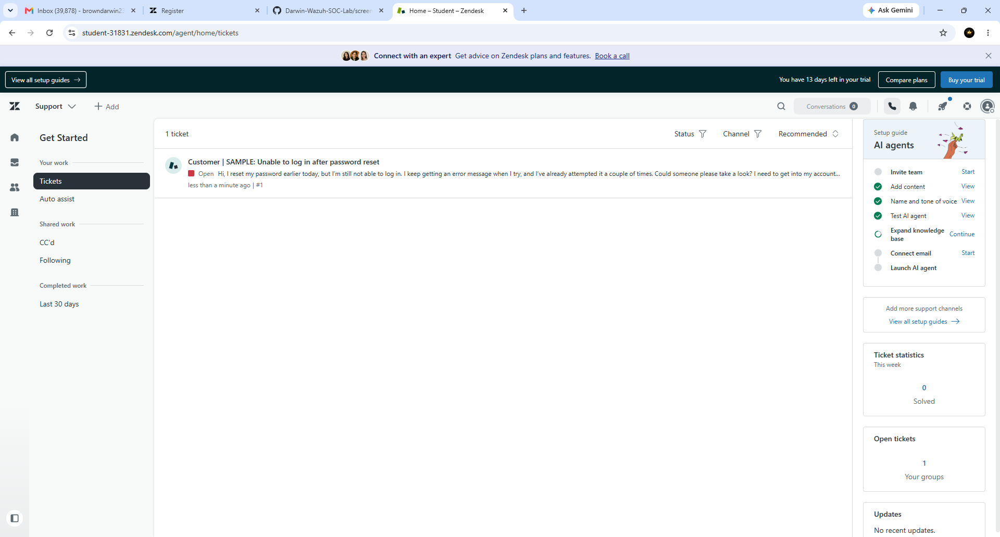
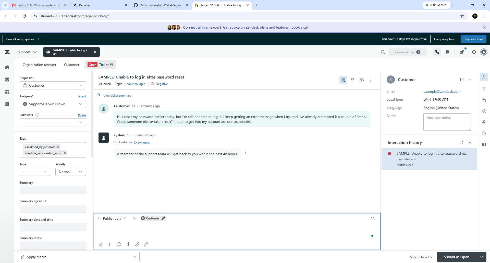
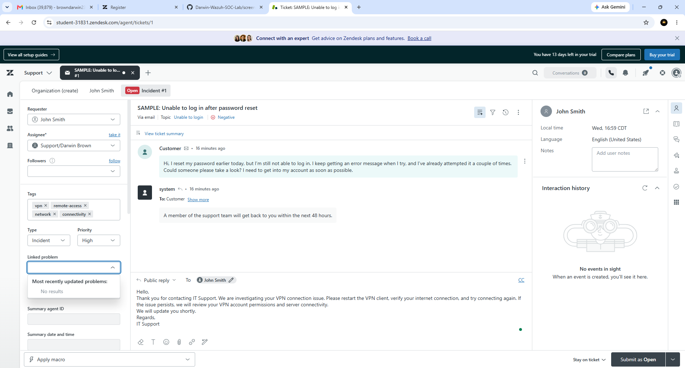
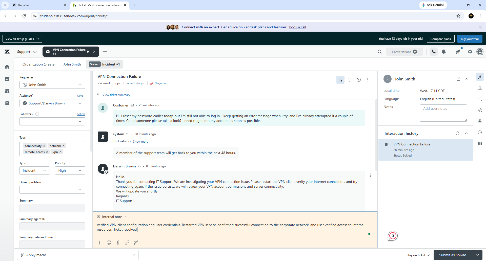
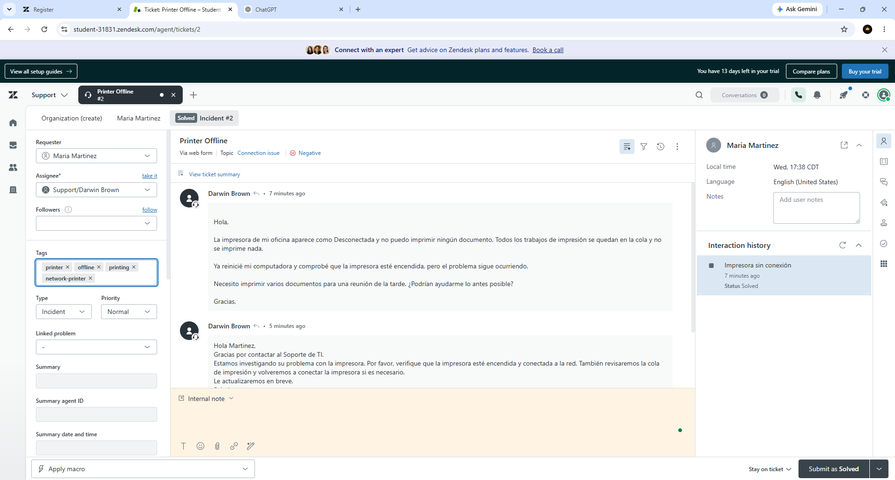
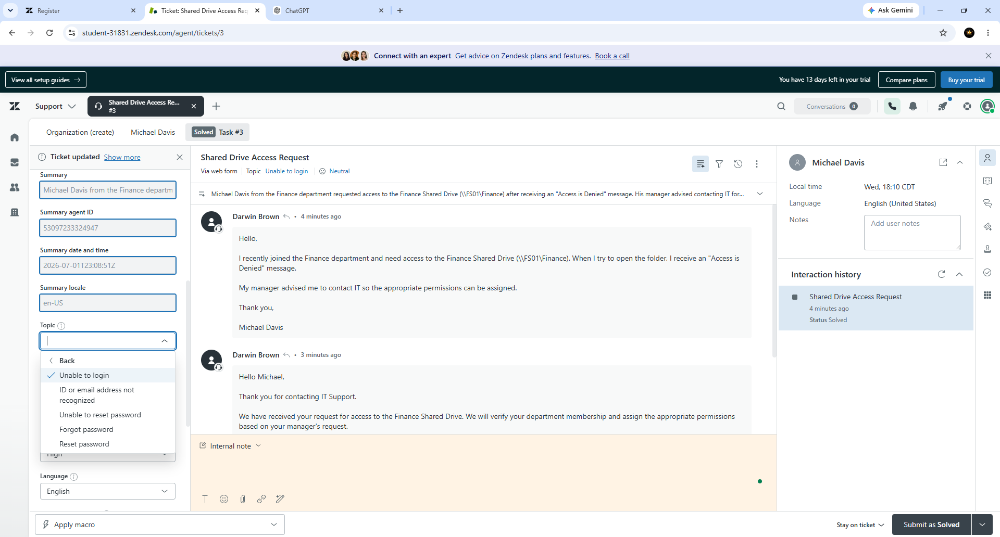
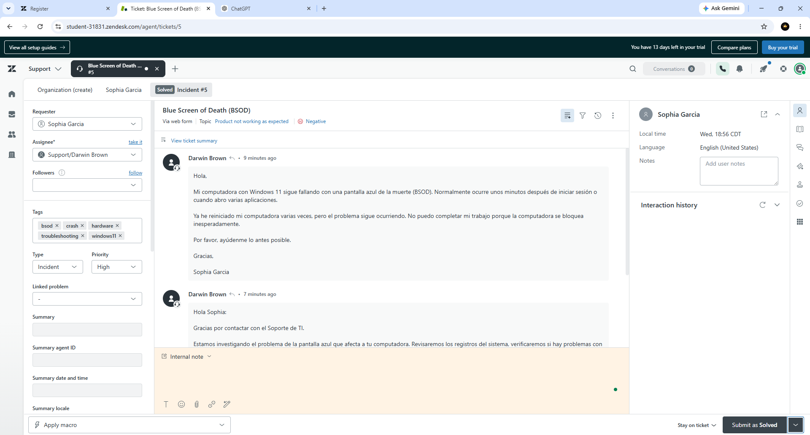

# Darwin-Zendesk-Help-Desk-Lab
Hands-on Zendesk Help Desk lab demonstrating IT support ticket management, incident resolution, service requests, customer communication, and technical documentation.

## Overview

This project demonstrates hands-on experience using Zendesk Support to manage Help Desk incidents and service requests. It showcases real-world IT support workflows including ticket creation, customer communication, troubleshooting, documentation, and ticket resolution.

The lab simulates common Help Desk scenarios performed by entry-level IT Support Specialists and Help Desk Technicians.

---

## Skills Demonstrated

- Zendesk Support
- Help Desk Ticket Management
- Incident Management
- Service Request Management
- Customer Communication
- Technical Troubleshooting
- Windows 11 Support
- Microsoft 365 Support
- VPN Troubleshooting
- Printer Troubleshooting
- Microsoft Teams Support
- Shared Drive Permissions
- Software Installation
- Internal Documentation

---

## Technologies Used

- Zendesk Support
- Windows 11
- Microsoft 365
- Microsoft Teams
- Adobe Acrobat Pro DC
- VPN Client
- Network Printers

---

# Tickets Completed

### Password Reset
Resolved a user account login issue by verifying account information and restoring access after a password reset.

### VPN Connection Failure
Diagnosed VPN connectivity issues, verified network connectivity, reset VPN credentials, restarted VPN services, and confirmed successful access.

### Printer Offline
Troubleshot a network printer that appeared offline by checking network connectivity, print queue status, and printer availability.

### Shared Drive Access Request
Verified user authorization, confirmed department membership, and assigned the required permissions to the Finance shared drive.

### Microsoft Teams Won't Launch
Investigated application startup failures by clearing the Teams cache, verifying updates, and preparing application repair procedures.

### Blue Screen of Death (BSOD)
Investigated repeated Windows crashes by reviewing system logs, checking drivers, and performing hardware and system diagnostics.

### Software Installation Request
Installed Adobe Acrobat Pro DC after verifying licensing, completed installation, and confirmed successful operation.

---

# Screenshots

## 1. Zendesk Dashboard Overview

Overview of the Zendesk Support workspace.



---

## 2. Password Reset Ticket

Password reset incident demonstrating customer communication and ticket management.



---

## 3. VPN Connection Failure

Customer-reported VPN connectivity issue.



---

## 4. VPN Connection Resolved

Documented troubleshooting steps and successful VPN restoration.



---

## 5. Printer Offline

Resolved a network printer connectivity issue.



---

## 6. Shared Drive Access Request

Granted access to a departmental shared drive after verifying user permissions.



---

## 7. Bluescreen of Death (BSOD)

Investigated Windows crash reports and documented troubleshooting.

.png)

---

## 8. Software Installation Request

Completed Adobe Acrobat Pro DC installation and verified successful deployment.



---

# What I Learned

- Managing the full Help Desk ticket lifecycle
- Communicating professionally with end users
- Documenting troubleshooting and resolutions
- Handling incidents and service requests
- Troubleshooting Windows 11 and Microsoft 365 issues
- Working with VPNs, printers, shared drives, and enterprise software
- Following Help Desk documentation best practices

---

## Repository Structure

```
Darwin-Zendesk-Help-Desk-Lab/
│
├── screenshots/
│   ├── 01-zendesk-dashboard-overview.png
│   ├── 02-password-reset-ticket.png
│   ├── 03-vpn-connection-failure-ticket.png
│   ├── 04-vpn-connection-failure-resolved.png
│   ├── 05-printer-offline-resolved.png
│   ├── 06-shared-drive-access-request.png
│   ├── 07-bluescreen-of-death-bsod.png
│   └── 08-software-installation-request.png
│
└── README.md
```

---

## Author

**Darwin Brown**
